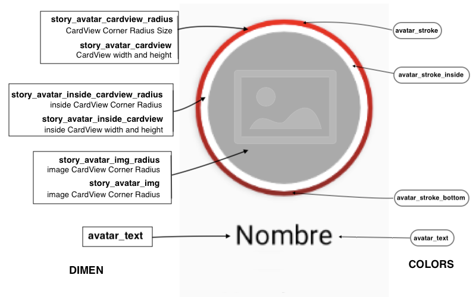

# Stories Lib

## 1. Add repository and dependency.
``` gradle
    repositories {
        maven { url 'https://github.com/anthorlop/mvn-android/raw/master/' }
    }
    ....
    dependencies {
        implementation 'com.anthorlop.components:Stories:1.0.2'
    }
```


## 2. Interfaces implementation in your Application class (onCreate method).
``` kotlin
   // Image Loader Interface Implementation
   StoriesManager.getInstance().setImageInterface(object : ImageLoaderInterface {
        override fun loadImage(context: Context, url: String, imageView: ImageView) {

            if (url.isEmpty()) return

            val picasso = Picasso.get().load(url)

            picasso.into(imageView, object : Callback {
                override fun onSuccess() {

                }

                override fun onError(e: Exception) {

                }
            })
        }
    })
        
    // StoriesInterface -> Catch events and set custom ViewPagerTransformer
    StoriesManager.getInstance().setstoriesInterface(object : StoriesInterface {
        override fun onShowMoreClicked(activity: Activity, idStory: Int, nameStory: String, storyType: String,
                                       idScene: Int, link: String) {
            val intent = Intent(Intent.ACTION_VIEW)
            intent.data = Uri.parse(link)
            activity.startActivity(intent)

            Log.d(toString(), " > > > onShowMoreClicked: story = $idStory, scene = $idScene")
        }

        override fun onAvatarClicked(position: Int, id: Int, name: String, storyType: String) {
            // enviar analitica
            Log.d(toString(), " > onAvatarClicked: position = $position, story = $id")
        }

        override fun onStoryDetailStarted(id: Int, name: String, type: String) {
            // enviar analitica
            Log.d(toString(), " > > onStoryDetailStarted:  story = $id")
        }

        override fun onSceneDetailStarted(id: Int, idStory: Int, nameStory: String, storyType: String) {
            // enviar analitica
            Log.d(toString(), " > > > onSceneDetailStarted:  scene = $id")
        }

        override fun onStoriesDetailClosed(fromUser: Boolean) {
            // enviar analitica
            Log.d(toString(), " > onStoriesDetailClosed: fromUser = $fromUser")
        }

        override fun getViewPagerTransformer(): ViewPager2.PageTransformer {
            return null
            // return ZoomOutPageTransformer()
        }
    })
```

## 3. Build your data.

You have to create an array of avatars and a stories one. (See MainActivity.kt)

## 4. Set configuration (optional).

You can set an URL to link the bottom text ("by anthorlop"), set null to hide it.
You can select the scene time and the ads time.
``` kotlin
    // set bottom text URL link, time for scenes and time for ads
    StoriesManager.getInstance().set("http://lombrinus.com", 5, 5)
```

## 5. Get View Bar and add it to your container.
### Avatars mode
``` kotlin
    findViewById<FrameLayout>(R.id.stories_bar_container).addView(
                StoriesManager.getInstance().getBarView(this, avatars, stories)
```
### Previews mode
``` kotlin
    findViewById<FrameLayout>(R.id.stories_bar_container).addView(
                StoriesManager.getInstance().getBarViewModePreview(this, avatars, stories)
```


## 6. Refresh View Bar if you want to update the viewed stories.
``` kotlin
    override fun onActivityResult(requestCode: Int, resultCode: Int, data: Intent?) {
        super.onActivityResult(requestCode, resultCode, data)

        if (requestCode == UE_STORIES_ACTIVITY_REQUEST_CODE) {
            val container = findViewById<FrameLayout>(R.id.stories_bar_container)
            StoriesManager.Companion.getInstance().refreshBarView(container)
        }
    }
```

## Custom colors, texts and icons.

You can customize your stories overriding colors, dimensions, texts or icons in your app.



Colors.xml:
``` xml
    <color name="avatar_stroke">#FF0000</color>
    <color name="avatar_stroke_bottom">#992222</color>
    <color name="avatar_stroke_inside">#fff</color>
    <color name="avatar_small_stroke">#fff</color>
    <color name="avatar_text">#000000</color>
    <color name="avatar_ad_text">#242424</color>
    <color name="avatar_ad_bg">#DADADA</color>
```
Dimen.xml
``` xml
    <dimen name="story_text">11sp</dimen>

    <!-- Avatar list -->
    <dimen name="story_avatar_cardview">72dp</dimen>
    <dimen name="story_avatar_cardview_radius">36dp</dimen>

    <dimen name="story_avatar_inside_cardview">68dp</dimen>
    <dimen name="story_avatar_inside_cardview_radius">34dp</dimen>

    <dimen name="story_avatar_img">62dp</dimen>
    <dimen name="story_avatar_img_radius">31dp</dimen>


    <!-- Small story detail avatar -->
    <dimen name="story_avatar_small_cardview">42dp</dimen>
    <dimen name="story_avatar_small_cardview_radius">21dp</dimen>

    <dimen name="story_avatar_small_inside_cardview">40dp</dimen>
    <dimen name="story_avatar_small_inside_cardview_radius">20dp</dimen>

    <dimen name="story_avatar_small_img">36dp</dimen>
    <dimen name="story_avatar_small_img_radius">18dp</dimen>
```

Strings.xml:
``` xml
    <string name="stories_show_more">Ver más</string>
    <string name="provider_text"><![CDATA[<font color="#ffffff">by</font> <font color="#03DAC5">anthorlop</font>]]></string>
```
Drawable icons:
``` xml
ic_stories_close.png
ic_stories_show_more.png
ic_stories_volume_off.png
ic_stories_volume_on.png
```


